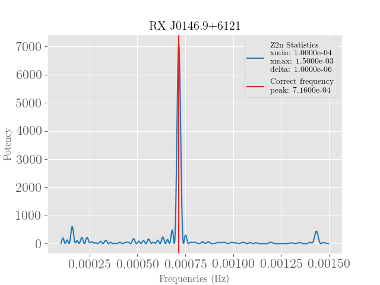

<!-- PROJECT SHIELDS -->
<!--
*** I'm using markdown "reference style" links for readability.
*** Reference links are enclosed in brackets [ ] instead of parentheses ( ).
*** See the bottom of this document for the declaration of the reference variables
*** for contributors-url, forks-url, etc. This is an optional, concise syntax you may use.
*** https://www.markdownguide.org/basic-syntax/#reference-style-links
-->


<!-- PROJECT LOGO -->
<br />
<p align="center">
  <a href="https://github.com/yohanalexander/z2n-periodogram">
    
  </a>

  <h1 align="center">Z2n Periodogram</h1>

  <p align="center">
    A package for periodograms from FITS datasets !
    <br />
    <a href="https://z2n-periodogram.readthedocs.io/"><strong>Explore the docs »</strong></a>
    <br />
    <br />
    <a href="https://github.com/yohanalexander/z2n-periodogram">View Demo</a>
    ·
    <a href="https://github.com/yohanalexander/z2n-periodogram/issues">Report Bug</a>
    ·
    <a href="https://github.com/yohanalexander/z2n-periodogram/issues">Request Feature</a>
  </p>
</p>

<!-- TABLE OF CONTENTS -->
## Table of Contents

* [About the Project](#about-the-project)
  * [Built With](#built-with)
* [Getting Started](#getting-started)
  * [Prerequisites](#prerequisites)
  * [Installation](#installation)
* [Usage](#usage)
* [Roadmap](#roadmap)
* [Contributing](#contributing)
* [License](#license)

<!-- ABOUT THE PROJECT -->
## About The Project

The Z2n Software is a python package for optimized periodograms from fits datasets. It program allows the user to calculate periodograms using the Z2n statistics a la Buccheri et al. 1983.

The standard Z2n statistics calculates the phase of each photon and the
sinusoidal functions above for each photon. Be advised that this is very computationally expensive if the number of photons is high.

### Built With
The Z2n Software was built using the open source language `Python`.
* [Python](https://python.org)


<!-- GETTING STARTED -->
## Getting Started

### Prerequisites

The version of the `Python` interpreter used during the development was the`3.7`, which can be managed in virtual environments such as `Anaconda`. Therefore, try to use the same version or one above.

* Python>=3.7
* PIP

To run the software properly you will need a lot of dependencies that can be managed by the Python package manager `PIP`, use the terminal command:
```sh
pip install -r requirements.txt
```

### Installation

The software is currently hosted at the Python central repository `PyPI`,  to install the software properly use the terminal command:
```sh
pip install z2n-periodogram
```

<!-- USAGE EXAMPLES -->
## Usage

To start the software just type `z2n` on the terminal (check if you're under the virtual environment that it is installed).
```sh
z2n
```
The `CLI` of the software is very interactive, for more information on the usage type `help`.
```sh
	Z2n Software (0.5.0), a package for interactive periodograms.
	Copyright (C) 2019, and MIT License, by Yohan Alexander [UFS].
	Type "help" for more information or "docs" for documentation.

	If you wish to run the software with the default values type "auto".

(z2n) >>> help

Documented commands (type help <topic>):
========================================
ascii  copyright  data  license  rate   stats
auto   credits    docs  plot     shell  version

Undocumented commands:
======================
exit  help  quit

(z2n) >>> 
```
_For more examples, please refer to the [Documentation](https://z2n-periodogram.readthedocs.io/)_

<!-- ROADMAP -->
## Roadmap

See the [open issues](https://github.com/yohanalexander/z2n-periodogram/issues) for a list of proposed features (and known issues).


<!-- CONTRIBUTING -->
## Contributing

Contributions are what make the open source community such an amazing place to be learn, inspire, and create. Any contributions you make are **greatly appreciated**.

1. Fork the Project
2. Create your Feature Branch (`git checkout -b feature/AmazingFeature`)
3. Commit your Changes (`git commit -m 'Add some AmazingFeature'`)
4. Push to the Branch (`git push origin feature/AmazingFeature`)
5. Open a Pull Request


<!-- LICENSE -->
## License

All content © 2020 Yohan Alexander. Distributed under the MIT License. See `LICENSE` for more information.

<a href="https://opensource.org/licenses">
    
  </a>
  <a href="https://github.com/YohanAlexander/z2n-periodogram/blob/master/LICENSE)">
    
  </a>

